# 4640-in-class-wk4
#### Nick Cao - A01429602
#### Luis G. Morin - A01433302

# Generate new SSH keypair
```bash
ssh-keygen -t ed25519 -f ~/.ssh/<key_name_here>
```

# General Setup
1) Create an ssh key
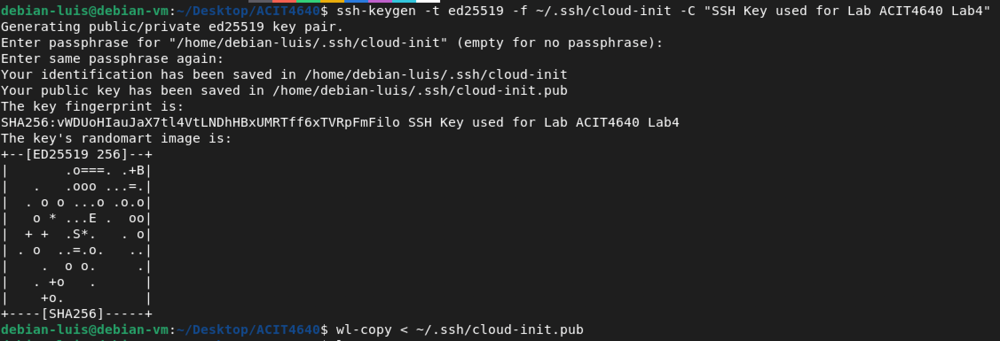

2) Clone starter files to Linux Environment

3) Install Terraform + Prerequisites
```bash
# get gpg keys to identify the hashicorp developers who maintain the repo
wget -O - https://apt.releases.hashicorp.com/gpg | sudo gpg --dearmor -o /usr/share/keyrings/hashicorp-archive-keyring.gpg

# add repo to list of package repositories
echo "deb [arch=$(dpkg --print-architecture) signed-by=/usr/share/keyrings/hashicorp-archive-keyring.gpg] https://apt.releases.hashicorp.com $(lsb_release -cs) main" | sudo tee /etc/apt/sources.list.d/hashicorp.list

# update repositories and install Terraform
sudo apt update && sudo apt install terraform
```

# Task 1 - Edit cloud-init file
1) Add your SSH public key to your cloud-init file
2) Add nginx and nmap packages to install on new instance
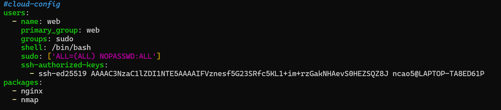

# Task 2 - Edit main.tf file to configure infrastructure
## Edit these blocks:
### 1 - AWS VPC block
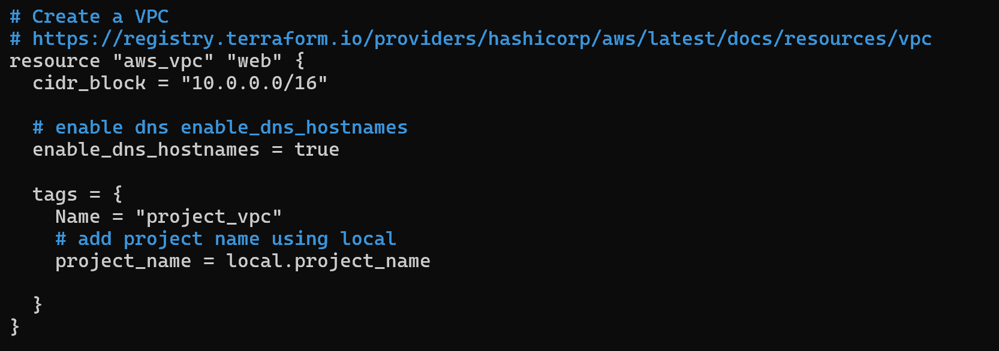

### 2 - AWS Public Subnet
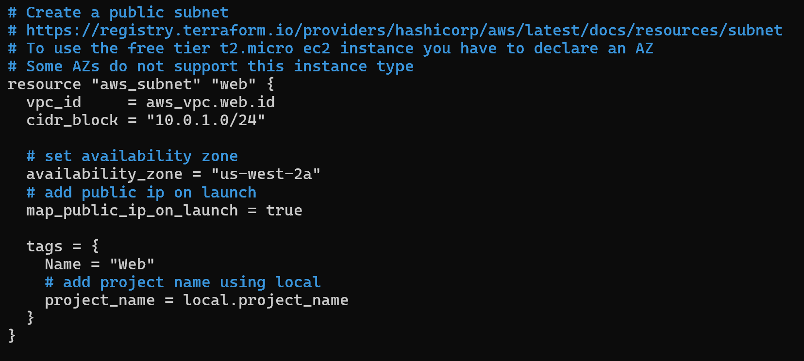

### 3 - Internet Gateway for VPC
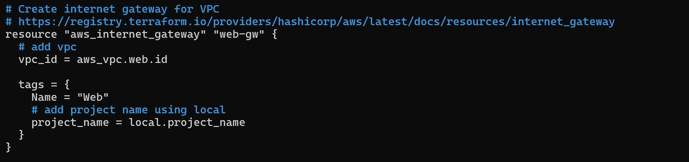

### 4 - AWS Route Table
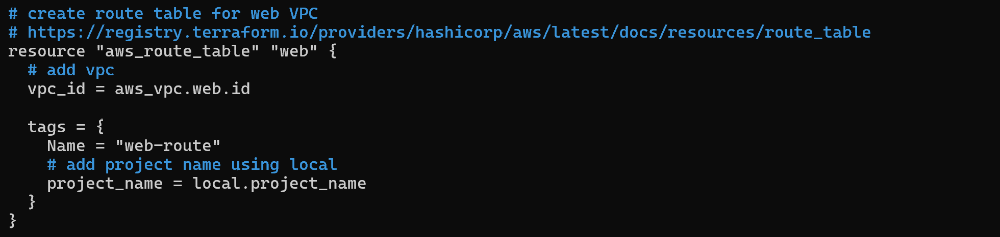

### 5 - Route TO route table
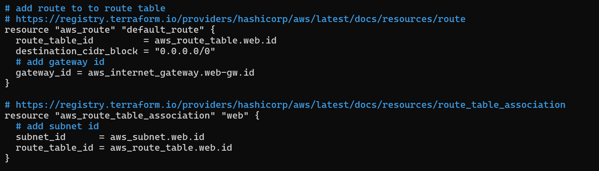

### 6 - Configure Security Group 
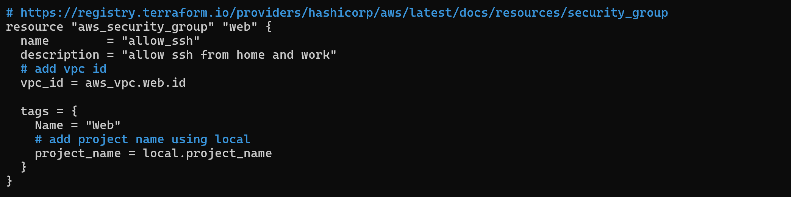

### 7 - Allow SSH and HTTP
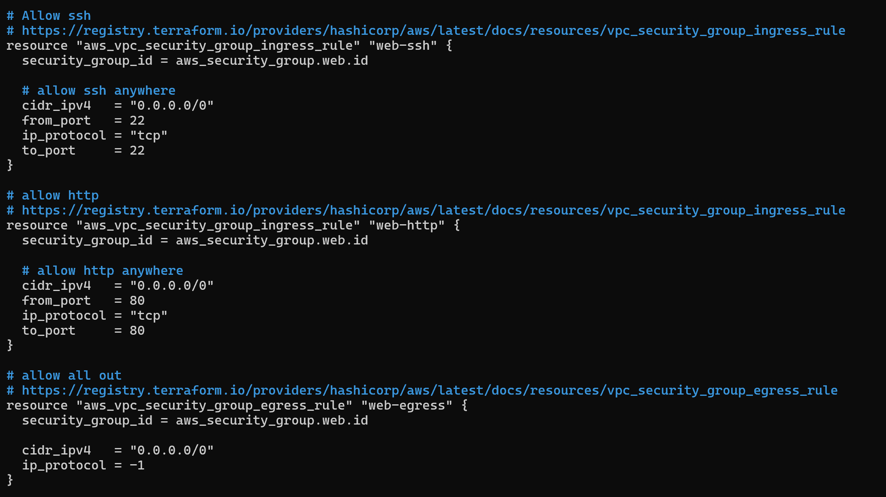

### 8 - Configure EC2 Instance
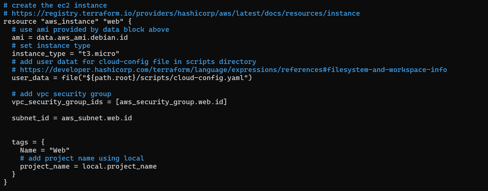

# Task 3 - Use Terraform to create infrastructure
```bash
terraform init
```
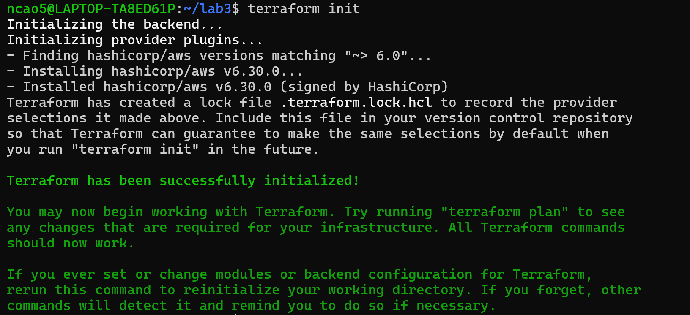
Make sure you run this command in the same directory as your `main.tf` and `./scripts/cloud-config.yaml`.

```bash
terraform fmt
```
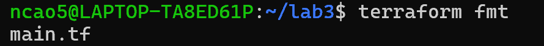


```bash
terraform validate
```
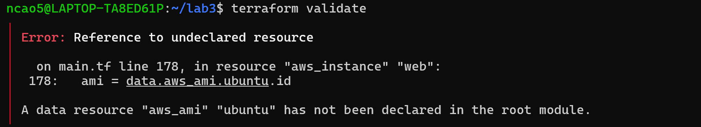
You may get an error with the configuration file. Luckily, it tells you where the error is and why it's happening.

```bash
terraform validate
```

Command is successful this time after fixing the error.

```bash
terraform plan -out lab-wk4
```
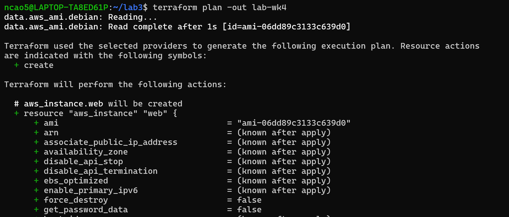

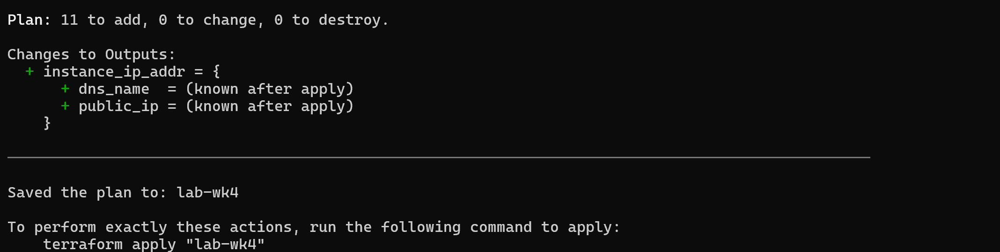

```bash
terraform apply lab-wk4
```
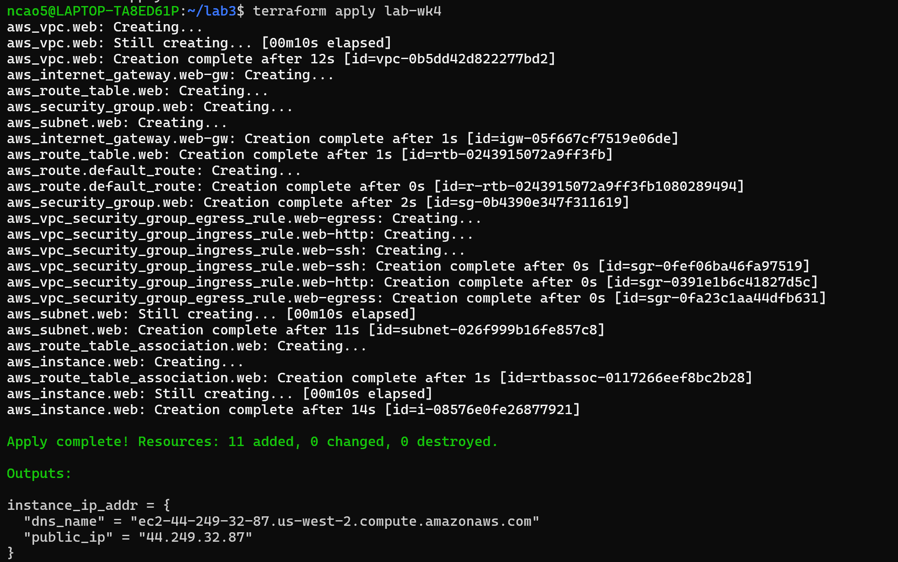

```bash
ssh -i ~/.ssh/lab-wk4 web@44.249.32.87
```
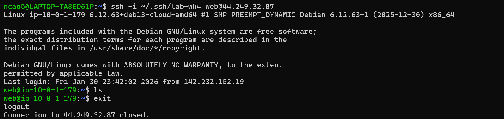
SSH into your new EC2 instance with the user you defined in the `cloud-config.yaml` file, and the IP given after applying the configuration, using the SSH key you generated during the setup.